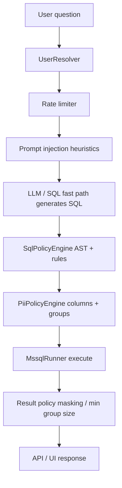
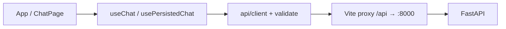
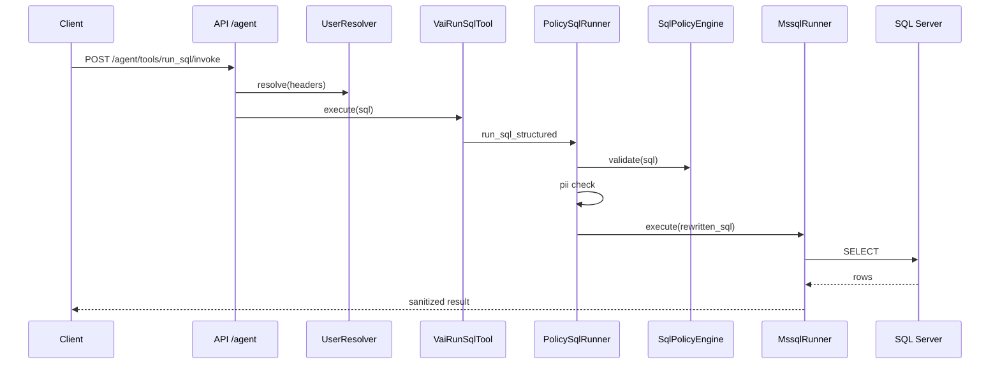

# Architecture

SQL Assistant turns natural-language questions into **read-only, policy-checked** T-SQL against a known profile.
The design centres on **defense in depth**: no single layer (LLM, prompt filter, or UI) is trusted alone.

## Layer boundaries

Dependencies flow **inward** only. Outer layers orchestrate; inner layers enforce invariants.

| Layer | Package / path | Responsibility | Must not |
|-------|----------------|----------------|----------|
| **HTTP** | `api/`, `web/serving.py` | Routing, CORS, rate limits, request schemas, liveness/readiness | Execute SQL or call LLM directly |
| **Identity** | `users/` | Resolve `User` from dev config or trusted headers | Grant `admin` from untrusted headers |
| **Orchestration** | `bootstrap.py`, `vanna_integration/`, `sqlfast/` | Wire Vanna agent, tools, fast path, lifespan | Bypass policy before `MssqlRunner` |
| **Policy (pure)** | `security/` | Validate SQL text and column sensitivity; audit metadata | Open DB connections |
| **Execution** | `db/mssql_runner.py` | Run **pre-approved** SQL; sanitize errors | Interpret natural language |
| **Knowledge** | `knowledge/`, `profiles/` | Schema profile, `SecurityPolicy` YAML | Runtime HTTP |
| **Memory** | `memory/` | Chroma embeddings for profile chunks / agent memory | Authorize queries |
| **Presentation** | `presentation/` | Shape answers and tables for API/UI | Change security policy |
| **Web UI** | `web/src/` | React app; client validation; no secrets in `localStorage` | Enforce server-side policy |

## Security pipeline (defense in depth)

Order matters. Later stages do not compensate for skipping earlier ones.



| Stage | Module | Fail mode | Notes |
|-------|--------|-----------|-------|
| Identity | `users/user_resolver.py` | 401 if header mode and no `X-User-Id` | `dev` only when `APP_ENV=dev` |
| Rate limit | `api/rate_limit.py` | 429 | Per user, IP, group, daily, concurrency |
| Prompt injection | `security/prompt_injection.py` | 400 on `/api/v1/chat` | **Not** a substitute for SQL policy |
| SQL policy | `security/sql_policy.py` | Reject (POL001–POL014) | AST-first; `TOP` rewrite on AST |
| PII policy | `security/pii_policy.py` | Reject PII001–003; warn PII004 | Group-aware column access |
| Execution | `db/mssql_runner.py` | Safe user message; details in logs only | Only entry point to pyodbc |
| Audit | `security/audit_log.py`, activity recorder | Append-only JSONL / Excel | No raw secrets; SQL fingerprint |

**Execution seam:** `PolicySqlRunner` → `MssqlRunner`. All tool and fast-path SQL must pass through this pair.

## HTTP surface

| Route family | Handler | Purpose |
|--------------|---------|---------|
| `/health`, `/ready` | `api/health.py` | Liveness vs readiness (agent/DB/memory) |
| `/api/v1/chat` | `api/v1/chat.py` | Primary UI chat; SQL fast path or `GuardedChatHandler` |
| `/api/v1/status`, `/profile`, `/tools` | `api/v1/*` | Diagnostics for React shell |
| `/agent/tools/*` | `api/query.py` | Vanna tool list/invoke (rate-limited) |
| `/app/*` | `web/serving.py` | Static SPA; **404** for missing `.js`/`.css` |

Deprecated: `/chat` aliases v1 chat stack.

## Runtime startup (`bootstrap.py`)

1. Load `Settings` (validated: no `dev` resolver in prod).
2. Configure logging (rotating files).
3. CORS from `CORS_ORIGINS` + dev localhost defaults.
4. `_initialise_runtime`: profile → Chroma memory → `build_vanna_runtime` (ODBC pool inside runner).
5. **Lifespan shutdown:** close httpx SQL-fast client and DB pool.

Heavy work (embedding model load) runs at import/startup; dev script waits for `/health` before Vite.

## Vanna integration seam

| Component | Role |
|-----------|------|
| `factory.build_vanna_runtime` | Single composition root for agent, tools, policies |
| `user_resolver_bridge` | Sync `UserResolver` → async Vanna `User` |
| `policy_sql_runner` | `SqlRunner` implementation; policy + execute + result shaping |
| `guarded_chat` | Rate limit + injection + audit before `Agent.send_message` |
| `vai_run_sql_tool` | Tool surface; errors sanitized for LLM |

## SQL fast path (`sqlfast/`)

Shortcut for clear analytical questions: compact context → JSON SQL → same **policy_sql_runner** stack as tools.
Does not skip `SqlPolicyEngine` / `PiiPolicyEngine`. May skip full Vanna agent loop when intent router agrees.

## Frontend architecture (`web/src/`)



- **`api/validate.ts`** — Last line of defense before rendering tables (malformed API responses).
- **`lib/fetchRetry.ts`** — Tolerates API still starting in dev.
- **Persistence** — Truncated history in `localStorage`; no row payloads.

## Database profile

Profiles under `profiles/<id>/` drive allow-lists, row filters, PII columns, and tool access groups.
Generated via CLI (`cli/generate_profile.py`); validated before deploy.

## System diagram

```mermaid
flowchart LR
    U[Browser / Client] --> API[FastAPI]
    API --> V1[/api/v1]
    API --> AGENT[/agent]
    API --> SPA[/app static]
    V1 --> FAST[SqlFastService]
    V1 --> GCH[GuardedChatHandler]
    FAST --> POL[PolicySqlRunner]
    GCH --> VANNA[Vanna Agent]
    VANNA --> POL
    POL --> SQL[SqlPolicyEngine]
    POL --> PII[PiiPolicyEngine]
    POL --> RUN[MssqlRunner]
    RUN --> DB[(SQL Server)]
    BOOT[Bootstrap] --> MEM[(Chroma)]
```

## User question → SQL (tool path)



## Further reading

- [CODE_DOCUMENTATION.md](./CODE_DOCUMENTATION.md) — docstring and comment conventions
- [SECURITY.md](../SECURITY.md) — production configuration
- [DATABASE_PROFILE_GUIDE.md](./DATABASE_PROFILE_GUIDE.md) — profile authoring
