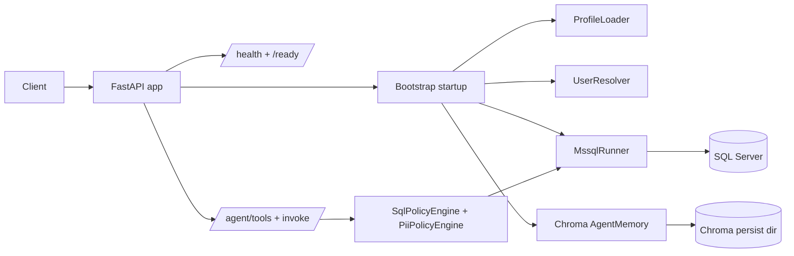
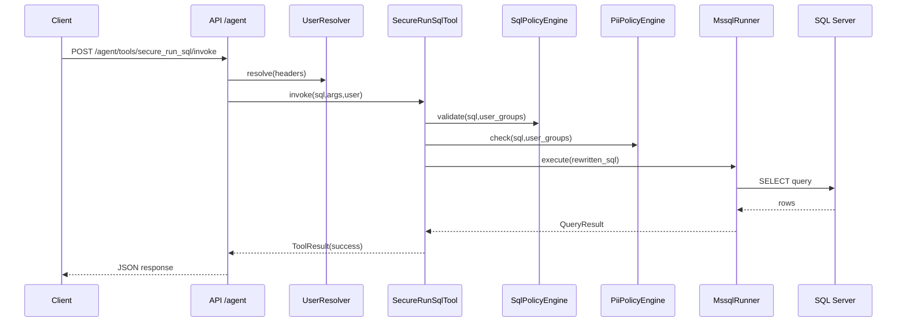
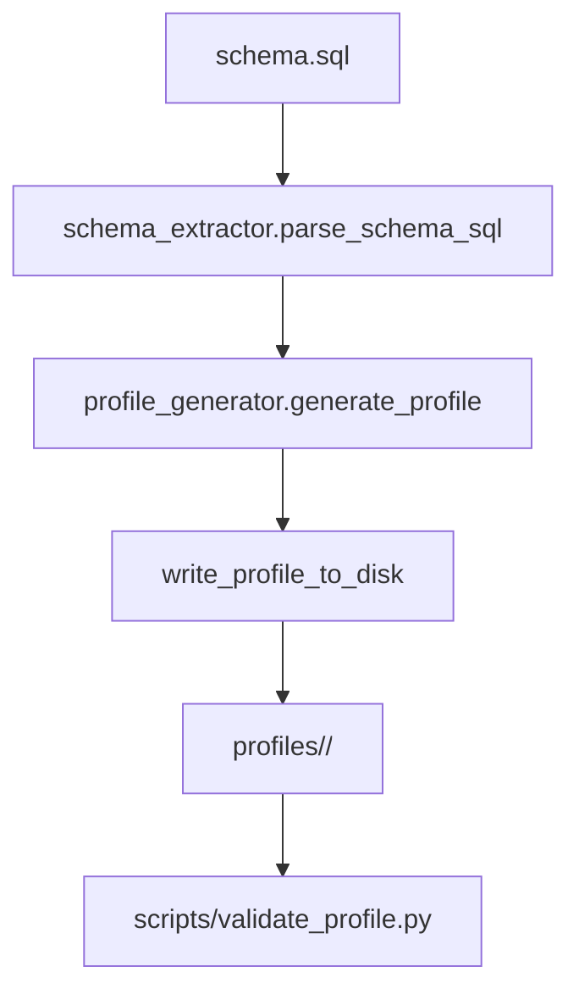
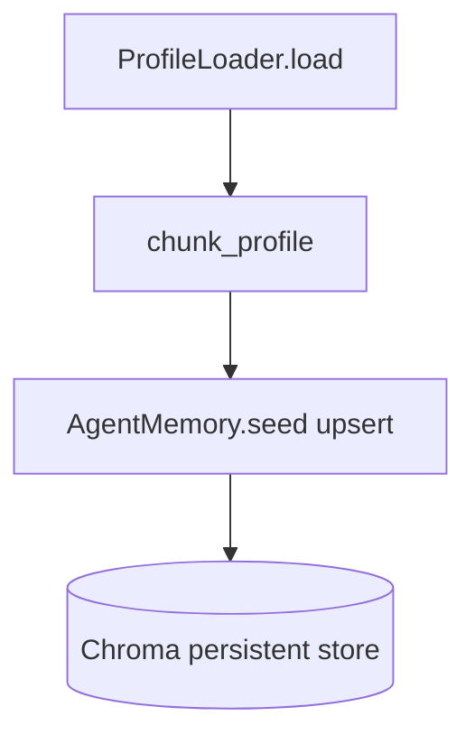
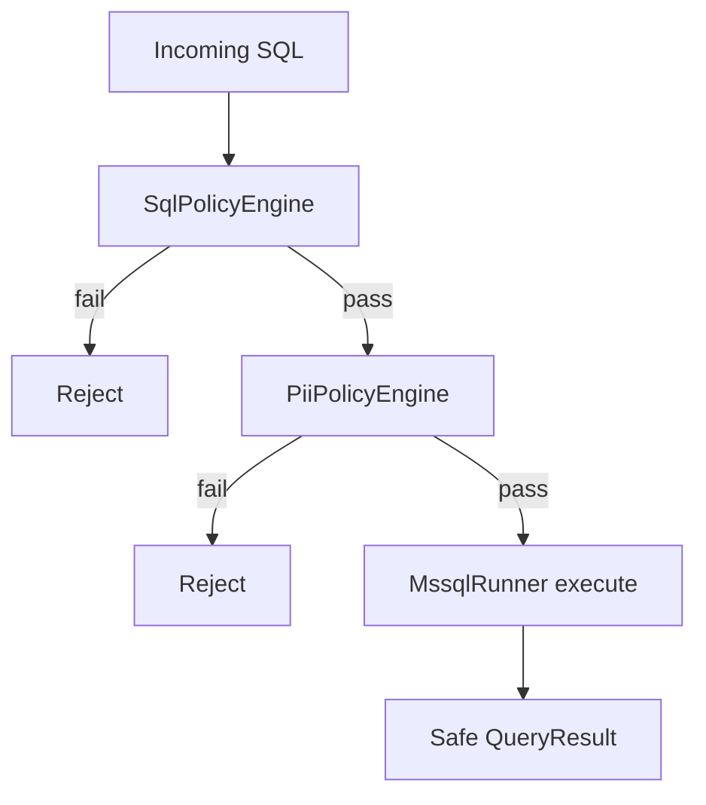

# Architecture

## System Architecture

```mermaid
flowchart LR
    U[Client] --> API[FastAPI app]
    API --> READY[/health + /ready/]
    API --> AGENT[/agent/tools + invoke/]
    API --> BOOT[Bootstrap startup]
    BOOT --> PROF[ProfileLoader]
    BOOT --> RES[UserResolver]
    BOOT --> RUN[MssqlRunner]
    BOOT --> MEM[Chroma AgentMemory]
    AGENT --> POL[SqlPolicyEngine + PiiPolicyEngine]
    POL --> RUN
    RUN --> DB[(SQL Server)]
    MEM --> CH[(Chroma persist dir)]
```

## User Question to SQL Flow

```mermaid
sequenceDiagram
    participant C as Client
    participant A as API /agent
    participant R as UserResolver
    participant T as SecureRunSqlTool
    participant S as SqlPolicyEngine
    participant P as PiiPolicyEngine
    participant M as MssqlRunner
    participant D as SQL Server

    C->>A: POST /agent/tools/secure_run_sql/invoke
    A->>R: resolve(headers)
    A->>T: invoke(sql,args,user)
    T->>S: validate(sql,user_groups)
    T->>P: check(sql,user_groups)
    T->>M: execute(rewritten_sql)
    M->>D: SELECT query
    D-->>M: rows
    M-->>T: QueryResult
    T-->>A: ToolResult(success)
    A-->>C: JSON response
```

## Database Profile Generation Flow

```mermaid
flowchart TD
    IN[schema.sql] --> EXT[schema_extractor.parse_schema_sql]
    EXT --> GEN[profile_generator.generate_profile]
    GEN --> WRT[write_profile_to_disk]
    WRT --> PDIR[profiles/<id>/]
    PDIR --> VAL[scripts/validate_profile.py]
```

## Memory Seeding Flow

```mermaid
flowchart TD
    P[ProfileLoader.load] --> C[chunk_profile]
    C --> U[AgentMemory.seed upsert]
    U --> CH[(Chroma persistent store)]
```

## SQL Security Validation Flow

```mermaid
flowchart TD
    Q[Incoming SQL] --> SP[SqlPolicyEngine]
    SP -->|fail| REJ1[Reject]
    SP -->|pass| PP[PiiPolicyEngine]
    PP -->|fail| REJ2[Reject]
    PP -->|pass| EX[MssqlRunner execute]
    EX --> RES[Safe QueryResult]
```
